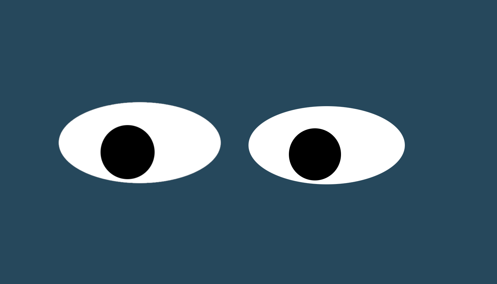

# Eyes Movement

## Introduction
The **"Eyes Movement"** project's goal is to handle elements in the DOM using Javascript.

## Instructions
* Fork and clone this repository.
* Open index.html in your browser.
* Move your mouse over the **"eyes"** and the **"eyes"** look in the direction the mouse is moved.

## Future Improvements
* Add "blinking" functionality when the user right clicks.

## Lincense
* [MIT License](https://mit-license.org/)
